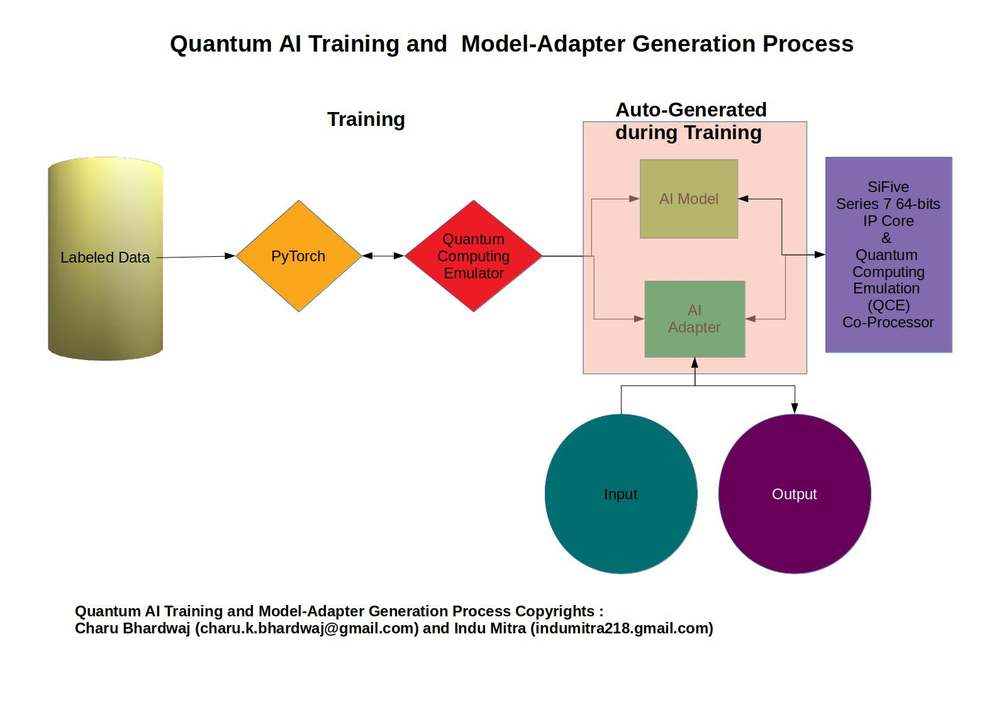

<!DOCTYPE HTML PUBLIC "-//W3C//DTD HTML 4.0 Transitional//EN">

<html>
<head>
    <meta http-equiv="content-type" content="text/html; charset=utf-8"/>
    <meta name="generator" content="LibreOffice 6.0.7.3 (Linux)"/>
    <meta name="created" content="2019-06-12T10:44:16"/>
    <meta name="changed" content="2019-06-16T22:39:29"/>
</head>
<body lang="en-IN" text="#000000" dir="ltr">

<b>Quantum Speech</b>

<i><b>Speech Analytics with
Emotions Recognition</b></i>

<i><b>for AWS
F1/FPGA/ASIC/Cloud Based Call (Contact) Centers</b></i>

 

<b>Common Objectives:</b>

 

To develop and to promote use of Multi-Lingual Emotions Recognition
AI Models-AI Adapters under common banner of Quantum Speech
consisting of Emotions Recognition and Speech Analytics through
public particpiation for public use.
Quantum
Speech is a common platform (as well as collection of AI Models-AI
Adapters for different natural languages)  where we showcase Emotions
Recognitions AI Models-AI Adpaters for participants and the
participants showcase different Speech Analytics Software (built
using the AI Models-AI Adpaters) for others.

 

<b>Motivation:</b>

 

Nature of emotions like as superposition states as shown in the
Plutchik’s human emotion model given below and nature of chain of
emotions in speech  like as entagled states motivate to treat
emotions Recognition AI models development for different natural
languages with the help of brain like quantum computing environment. 

 

<b>Plan: </b>

 

Initially the public participation will be in audio data labeling and
speech analystics software development usually developed using
database and business intelligence software, but other more advanced
areas like Chisel/Scala/Verilog/RISC-V may be openned in future as
per participants demand if the intial response is good. The work
coordination will be done through github. 

 

<b>Quantum Speech</b> 
consists of series of proposed deep learning multi-lingual emotions
Recognition models super-refined by Quantum Computing  and
auto-generated by our Quantum AI Training and AI Model-Adpater
Generation Process given in the diagram below and speech analystics
software developed by the participants/developers:  

 

<b>The training process can also generate AI Models-Adapters for
different fields of AI applications other than emotions
Recognition.</b>

 

<i><b>Note: Please view or download Quantum-Speech.pdf file from the
repository for complete details.</b></i>

</body>
</html>
