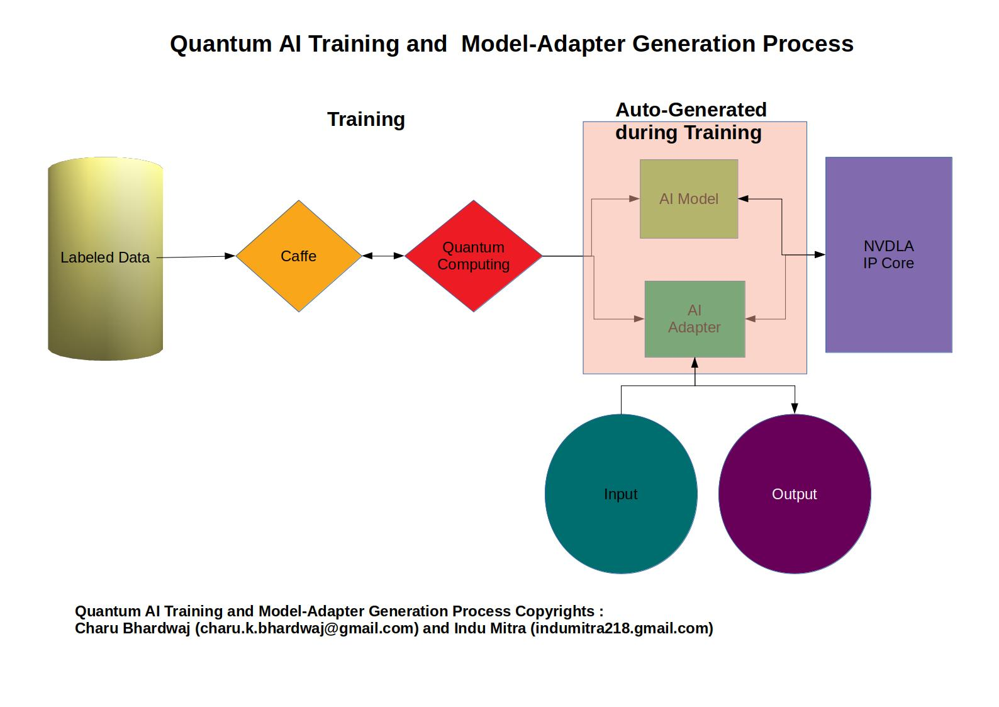

<!DOCTYPE HTML PUBLIC "-//W3C//DTD HTML 4.0 Transitional//EN">

<html>
<head>
    <meta http-equiv="content-type" content="text/html; charset=windows-1252"/>
    <title></title>
    <meta name="generator" content="LibreOffice 5.4.5.1 (Windows)"/>
    <meta name="created" content="2019-06-12T10:44:16.602917520"/>
    <meta name="changed" content="2019-06-16T21:17:55.527000000"/>
    
</head>
<body lang="en-IN" dir="ltr">

<b>Quantum
Speech</b>

<i><b>Speech
Analytics with Emotions Recognization</b></i>

<i><b>for
AWS F1/FPGA/ASIC/Cloud Based Call (Contact) Centers</b></i>

 

<b>Common
Objectives:</b>

 

To
develop and to promote use of Multi-Lingual Emotions Recognization AI
Models-AI Adapters under common banner of Quantum Speech consisting
of Emotions Recognization and Speech Analytics through public
particpiation for public use.
Quantum
Speech is
a
common
platform
(as
well as collection of AI
Models-AI
Adapters for
different natural languages)
 where we showcase
Emotions Recognitions AI Models-AI Adpaters for participants and the
participants showcase
different Speech Analytics Software
(built
using
the AI Models-AI Adpaters)
for others.

 

<b>Motivation:</b>

 

Nature
of emotions like as superposition states as shown in the Plutchik&rsquo;s
human emotion model given below and nature of chain of emotions in
speech  like as entagled states motivate to treat emotions
recognization AI models development for different natural languages
with the help of brain like quantum computing environment.  

 

<b>Plan:
</b>

 

Initially
the public participation will be in audio data labeling and speech
analystics software development usually developed using database and
business intelligence software, but other more advanced areas like
Chisel/Scala/Verilog/RISC-V may be openned in future as per
participants demand if the intial response is good. The work
coordination will be done through github. 

 

<b>Quantum
Speech</b>  consists of series of proposed deep learning
multi-lingual emotions recognization models super-refined by Quantum
Computing  and auto-generated by our Quantum AI Training and AI
Model-Adpater Generation Process given in the diagram below and
speech analystics software developed by the participants/developers: 

 

<b>The
above process can also generate AI Models-Adapters for different
fields of AI applications other than emotions recognization.</b>

 

<b>A.
</b><b>Labeled Data:</b>
 Only the label data preparation process for emotion recognization is
described here though the process which can accomadate labeled data
from other artifical intelligence application areas as well. The
participant observes emotions word by word labels these according to
the naming convention gievn below and our training process generates
learned AI-Models and AI-Adapters for emotions recognization.

 

We
can use Audacity for labeling data and VLC to record audio files from
downloaded youtube videos for further processing though Audacity,
please take care of copyrights. Links are given below to help in
label data generation:

 

Download
Audacity:

<a href="https://sourceforge.net/projects/audacity/">https://sourceforge.net/projects/audacity/</a>

 

Tutorial
on Labeling Data with Audacity:

<a href="https://www.youtube.com/watch?v">https://www.youtube.com/watch?v</a><a href="https://www.youtube.com/watch?v=JR7ehNSqIq4">=JR7ehNSqIq4</a>

 

Download
VLC Media Player:

<a href="https://www.videolan.org/vlc/index.html">https://www.videolan.org/vlc/index.html</a>

 

Tutorial
on Downloading Youtube Videos with VLC:

<a href="https://www.youtube.com/watch?v=9G2VpHhPTgM">https://www.youtube.com/watch?v=9G2VpHhPTgM</a>

Converting
Video to Audio Files with VLC:

<a href="https://www.youtube.com/watch?v=Zmi3-a_sD7s">https://www.youtube.com/watch?v=Zmi3-a_sD7s</a>

 

Many
tutorials on denoising and preparing audio files before labeling with
Audacity are available on the internet. Please ensure to include
mutliple and different sampled labeled data files for as many words
as usually used to descibe different emotions in a given natural
language are covered. Please use Plutchik&rsquo;s simplified human
emotion model given in this document to describe emotions with the
ultimate aim that the Plutihik&rsquo;s detailed human emotion model
will be used  in   generated AI Model for emotions recognization once
sufficient labeled data is made available over the time  in the
future versions. 

 

<b>Labeled
Data File Naming Convention Compatible with the Training Process:</b>

 

Each
labeled
file should
have
a unique filename. The filename should
consist
of seven two-digit numerical identifiers, separated by hyphens (e.g.,
02-01-06-01-02-01-12.wav).
Each two-digit numerical identifier should
define
the level of a different experimental factor. The identifiers are
ordered:
FileType&ndash;Channel&ndash;Emotion&ndash;Intensity&ndash;Statement&ndash;Repetition&ndash;Actor.wav.
The numerical coding of levels is described in following
table
For example, the filename &ldquo;02-01-06-01-02-01-12.wav&rdquo;
refers to: Video-only (02)&ndash;Speech (01)&ndash;Fearful
(06)&ndash;Intensity normal (01)&ndash;Statement &ldquo;Hello
World&rdquo;
02)&ndash;First
repetition (01)&ndash;Twelfth actor, female (12). The gender of the
actor is coded by the actor&rsquo;s number, where odd numbered actors
should
be
male, even numbered actors should
be
female.

 

 

 

<table width="643" cellpadding="4" cellspacing="0">
    <col width="104">
    <col width="521">
    <thead>
        <tr valign="top">
            <th width="104" style="border-top: 1px solid #000000; border-bottom: 1px solid #000000; border-left: 1px solid #000000; border-right: none; padding-top: 0.1cm; padding-bottom: 0.1cm; padding-left: 0.1cm; padding-right: 0cm">
                
Identifier

            </th>
            <th width="521" style="border: 1px solid #000000; padding: 0.1cm">
                
Description

            </th>
        </tr>
    </thead>
    <tbody>
        <tr valign="top">
            <td width="104" style="border-top: none; border-bottom: 1px solid #000000; border-left: 1px solid #000000; border-right: none; padding-top: 0cm; padding-bottom: 0.1cm; padding-left: 0.1cm; padding-right: 0cm">
                
<b>FileType</b>

            </td>
            <td width="521" style="border-top: none; border-bottom: 1px solid #000000; border-left: 1px solid #000000; border-right: 1px solid #000000; padding-top: 0cm; padding-bottom: 0.1cm; padding-left: 0.1cm; padding-right: 0.1cm">
                
<b>01=Audio-Only,
                 02=Video-Only, 03=Audio-Video</b>

            </td>
        </tr>
        <tr valign="top">
            <td width="104" style="border-top: none; border-bottom: 1px solid #000000; border-left: 1px solid #000000; border-right: none; padding-top: 0cm; padding-bottom: 0.1cm; padding-left: 0.1cm; padding-right: 0cm">
                
<b>Channel
                </b>
                

            </td>
            <td width="521" style="border-top: none; border-bottom: 1px solid #000000; border-left: 1px solid #000000; border-right: 1px solid #000000; padding-top: 0cm; padding-bottom: 0.1cm; padding-left: 0.1cm; padding-right: 0.1cm">
                
<b>01=Speech,
                02=Song</b>

            </td>
        </tr>
        <tr valign="top">
            <td width="104" style="border-top: none; border-bottom: 1px solid #000000; border-left: 1px solid #000000; border-right: none; padding-top: 0cm; padding-bottom: 0.1cm; padding-left: 0.1cm; padding-right: 0cm">
                
<b>Emotion</b>

            </td>
            <td width="521" style="border-top: none; border-bottom: 1px solid #000000; border-left: 1px solid #000000; border-right: 1px solid #000000; padding-top: 0cm; padding-bottom: 0.1cm; padding-left: 0.1cm; padding-right: 0.1cm">
                
<b>00=Normal,
                01=Angry, 02=Afraid, 03=Surprised, 04=Happy, Sad=05, Disgusted=06</b>

            </td>
        </tr>
        <tr valign="top">
            <td width="104" style="border-top: none; border-bottom: 1px solid #000000; border-left: 1px solid #000000; border-right: none; padding-top: 0cm; padding-bottom: 0.1cm; padding-left: 0.1cm; padding-right: 0cm">
                
<b>Intensity</b>

            </td>
            <td width="521" style="border-top: none; border-bottom: 1px solid #000000; border-left: 1px solid #000000; border-right: 1px solid #000000; padding-top: 0cm; padding-bottom: 0.1cm; padding-left: 0.1cm; padding-right: 0.1cm">
                
<b>01=Normal,
                02=Strong</b>

            </td>
        </tr>
        <tr valign="top">
            <td width="104" style="border-top: none; border-bottom: 1px solid #000000; border-left: 1px solid #000000; border-right: none; padding-top: 0cm; padding-bottom: 0.1cm; padding-left: 0.1cm; padding-right: 0cm">
                
<b>Statement</b>

            </td>
            <td width="521" style="border-top: none; border-bottom: 1px solid #000000; border-left: 1px solid #000000; border-right: 1px solid #000000; padding-top: 0cm; padding-bottom: 0.1cm; padding-left: 0.1cm; padding-right: 0.1cm">
                
<b>01=&rdquo;Hello,
                World&rdquo; 02-&rdquo;How Are You&rdquo;, 03=...</b>

            </td>
        </tr>
        <tr valign="top">
            <td width="104" style="border-top: none; border-bottom: 1px solid #000000; border-left: 1px solid #000000; border-right: none; padding-top: 0cm; padding-bottom: 0.1cm; padding-left: 0.1cm; padding-right: 0cm">
                
<b>Repetition</b>

            </td>
            <td width="521" style="border-top: none; border-bottom: 1px solid #000000; border-left: 1px solid #000000; border-right: 1px solid #000000; padding-top: 0cm; padding-bottom: 0.1cm; padding-left: 0.1cm; padding-right: 0.1cm">
                
<b>01=1st,
                02=2nd, 03=3rd, ...</b>

            </td>
        </tr>
        <tr valign="top">
            <td width="104" style="border-top: none; border-bottom: 1px solid #000000; border-left: 1px solid #000000; border-right: none; padding-top: 0cm; padding-bottom: 0.1cm; padding-left: 0.1cm; padding-right: 0cm">
                
<b>Actor</b>

            </td>
            <td width="521" style="border-top: none; border-bottom: 1px solid #000000; border-left: 1px solid #000000; border-right: 1px solid #000000; padding-top: 0cm; padding-bottom: 0.1cm; padding-left: 0.1cm; padding-right: 0.1cm">
                
<b>01=Urvi,
                02=Neha, 03=Priya, ...</b>

            </td>
        </tr>
    </tbody>
</table>

 

<b>B.
Caffe:</b>

 

Caffe
is a deep learning framework made with expression, speed, and
modularity in mind. It is developed by Berkeley AI Research (<a href="http://bair.berkeley.edu/">BAIR</a>)
and by community contributors.&nbsp;<a href="http://daggerfs.com/">Yangqing
Jia</a><b>&nbsp;</b>created
the project during his PhD at UC Berkeley. Caffe is released under
the&nbsp;<a href="https://github.com/BVLC/caffe/blob/master/LICENSE">BSD
2-Clause license</a>.

 

For
more details, please visit: <a href="https://caffe.berkeleyvision.org/">https://caffe.berkeleyvision.org/</a>

 

<b>C.
</b><b>Quantum
Computing (QC):</b>

 

Quantum
Mechanics (QM), a branch of physics related to microscopic world of
electrons, atoms, molecules etc has ushered the revolution of
semiconductors and consequently revolutionalized IT Industry and
Telecommunication Industry to name a few apart from Chemical and
Biochemical Industries. The mathematics behind the Quantum Mechanics
(QM), which can also be summed up as Quantum Computing (QC) in the
information science, is the same as believed to be behind the neural
processing of the biological/biochemical brain, though the links, in
physics, behind the two are yet to be clearly understood by the
scientists. This is just in confirmation with physics-mathematics
traditions-some times physics leads mathematics and sometimes
mathematics leads physics.  

 

QC
is quite different from the classical computing with respect to flow
bits (qubits in QC)-details of QC will quitely justify a thousand
page plus volume itself so we will focus on implementations of it
with respect to speech only. Speech not only convey signals to be
translated into test and understood, but the complete understanding
of speech involves emotions apart from text. Since speech containing
emotions can be better proceesed using QC in brain like processing
environment so the motiovation for emotions recognization aspects of
Quantum Speech is self evident.

 

QC
is yet to be available as a commodity product for masses. Many
commerical setups for QC algorithm development and experiments are
available at affordable cloud platform open for public use, for
example:  

 

IBM
Q Experience:

<a href="https://quantum-computing.ibm.com/login">https://quantum-computing.ibm.com/login</a>

 

Microsoft
Quantum Computing:

<a href="https://www.microsoft.com/en-in/quantum/">https://www.microsoft.com/en-in/quantum/</a>

 

 

D-Wave
Quantum Computing:

<a href="https://www.dwavesys.com/quantum-computing">https://www.dwavesys.com/quantum-computing</a>

 

With
the availability of above the dawn of QC has arrived and is real,
which will pave the way for mass applications in near future.

 

Though
our QC emulation system can be easily ported to above such systems
but we compfortably use our QC emulation system based on Apple Mac
Clusters and Xilinx Zynq FPGA Boards without significant loss of
comparable speed and comparable accuracy at comparably much cheaper
price with comparably significantly higher availability time and
controlled environment. The process descibed in the above diagram is
made available on our QC emulation system and above all is available
free of cost to those who participate with us in development of
quantum speech under free of cost open source licensing scheme of
their choice where the AI Model will be available under open source
license and the relevant AI adapter will be distribued free of cost
in binary form as shareware. Commercial options can be worked out in
consultation with the concerned participant of Quantum Speech for a
particular language(s) if the participant so desire.

 

<b>D.
AI Model and AI Adapter:</b>

 

Since
QC is used here for super-refining the AI Models and AI Adapters
Generation during training process, so no attempt is made to
implement of QC at FPGA/ASIC level or at AWS F1, the generated AI
Adapters automatically take care of the necessary minimised and
optimised AI implementaion side requisits in classical computing
itself. AI Models are basically NVDLA compatible data models. 

 

<b>E.
NVDLA:</b>

 

NVDLA
, the FPGA/ASIC IP Core ,is provided by NVDIA under free of costs
open source for commercial use. The IP Core can be freely used in
FPGA/ASIC/AWS F1 implementations and can be very well integrated to
RISC-V architecture.

 

For
more details, please visit: 

<a href="http://nvdla.org/">http://nvdla.org/</a>

<a href="https://riscv.org/">https://riscv.org/</a>

<a href="https://aws.amazon.com/ec2/instance-types/f1/">https://aws.amazon.com/ec2/instance-types/f1/</a>

 

<b>F.
Input and Output:</b>

 

Live
audio stream usually accompanied by pre-processed text by pocketshinx
speech recognization software is trasnfered to the AI Adapter which
in turn hands it over to NVDLA and the AI Adapter collects the
results with recognized emotion in text forms suitably appened to the
speech text recognized by the pocketsphinx for further processing by
chatbot like E.D.D.I and then there after festvox text to speech
converter. At another end AI Adapter can dump speech data directly
into database for further processing and visualization through a
business intelligence software.

 

For
more details, please visit:

<a href="https://cmusphinx.github.io/wiki/">https://cmusphinx.github.io/wiki/</a>

<a href="http://www.festvox.org/">http://www.festvox.org</a>

<a href="https://eddi.labs.ai/">https://eddi.labs.ai/</a>

 

 

<b>G.
Copyrights:</b>

 

As
stated in the above diagram, Charu Bhardwaj and Indu Mitra own the
Quantum AI Training and Model-Adapter Generation Process. Since the
labeled data will be owned and developed for a particular spoken
language by the participants so the relevant contributed AI Model
(under the Quantum Speech) copyrights will be shared with the
contributing participants of that particular AI Model under the terms
and conditions framed in advance in consultation with the
participant. The relevant AI Adapter will be available as shareware
in executable binary form if the participant agrees to releases the
AI Model free of cost to public.

 

<b>H.
Contact Details:</b>

 

Concerned
Person: Charu Kanzehr Bhardwaj

Email:
<a href="mailto:charu.k.bhardwaj@gmail.com">charu.k.bhardwaj@gmail.com</a>

 

Any
query or suggestion related to further improvements may be sent to
the above email address.

 

<b>Execution/Implementation: </b>

 

In
order to promote Quantum Speech, we see, as
first instance, may be due
to our past experience, great market in Call/Contact Industry for
Emotions
Recognization enabled
Speech Analytics, though there are other significant
applications in other
market areas as well like
toys, Alexa like speakers etc.
For your reference, we
propose following techno-commercial model
for  Call/Contact Center
Industry with user
required scalability,
adjustments and
configurations. It can be
as small as WebRTC enabled voiced chatbot or as scalable as  Twilio
like virtual telecommunication
operator. 

 

The
techno-commercial model given here is meant to be execuatble on
Amazon AWS F1 instances.
We have developed  Quantum Speech Simulator containing
 Emtions
Recognization, Text-to-Speech, Speech-to-Text (excluding other
components mentioned in the techno-commercial model)  
along with AI Model and AI Adapter in
Amazon Linux 2 VDI
file which can be run
under Virtual Box. In
order to make on-premise
testing and validation
without paying for Amazon AWS F1 services possible for participants,
the simulator along with
your AI Model and our AI Adapter (in
VDI file) can
be made available to the participants free
of costs. Practically
speaking, participants
need to build the labeled data at their own
costs and rest is available free of costs before they
decide to go to 
commercial/production
implementation at Amazon AWS F1. 

 

AI
Adapter running under simulator can be connected to the
database,
this feature can be particularly helpful for those participants, who
want to do further software development like Speech Analytics or test
deployment at their own premises.

 

<b>A. Applications:</b>

 

Virtual-Agents
&amp; Speech Analytics for Marketing/Contact Centers, Personal
Assistants, Robotics, Toys/Virtual Pets, AR/VR/MR/Games, Automated
Car Voice Communication,  Autopilot Voice Communication in Civil
Aircrafts, Fire-control Voice Communication in Military Aircrafts,
Medical/Forensic/Police-Inestigation which can be furher enhanced by
Vision, EEG, ECG, Ultrasound, MRI inputs etc. 

 

 

<b>B.
For Customers:</b>

 

Analysis
of emotions in speech is very important for marketing/contact centers
and other applications mentioned above, advent of virtual agents in
contact centers has further increased its importance.    Plutchik&rsquo;s
human emotion model as shown in detailed and simplified diagrams
below:

 

 

<b>Detailed Model: </b>

 

 

 

<b>Simplified Model:</b>

 

 

<b>Emotions
when coupled with thoughts, expressed in speech </b><b>as
</b><b>in </b><b>this</b><b>
case, become the basis of Speech Analysis of Sentiments and
Intentions. </b><b>The</b><b>
Speech Artificial Intelligence implemented in Amazon AWS EC2 F1
running at Xilinx Virtex UltraScale+ XCVU9P FPGAs </b><b>can</b><b>
power the </b><b>very</b><b>
scalable </b><b>E</b><b>motion</b><b>s</b><b>
</b><b>Recognization
and</b><b> </b><b>Speech
Analysis. </b>

 

<b>C.
For Software Developers:</b>

 

The
free mobile app may make developers take advantage of the platform by
just training, configuring, testing, managing and incorporating phone
call interface through WebRTC and optionally APIs calls interface
through REST-APIs and extended added value to their customers&rsquo;
businesses. 

 

<b>Organization:</b>

 

Pariticpating
individuals and organizations can set their own marketing, financial,
and technical support  terms &amp; conditions, but are advised to
check before hand with  the concerned participants for such terms &amp;
conditions and technical dependecies if applicable. Though AI Models
and AI Adapters (in executable binary form only) may be provided free
of costs but no source codes or part thereof will be provided,  and
for the moment no direct access to  the proprietary (QC part only)
Quantum AI Training Process will be provided, in other words
conversion from Labeled Data to AI Models and AI Adapters will be
done at our premise. Terms and conditions before such conversion can
be mutually agreed upon. The participants website links alongwith
Quantum Speech based projects wiki page in our github account can
also be provided free of cost on request.  Visit
<a href="https://github.com/quantum-speech">https://github.com/quantum-speech</a>
for latest updates.

</body>
</html>
